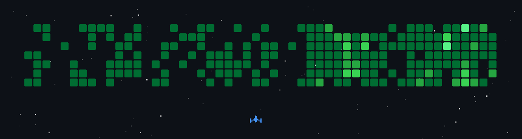

<div align="center">


<a href="https://linkedin.com/in/harshith-ashok/"></a>
<a href="https://harshithashok.com"></a>

</div>



<br/>

```bash
┌──(harshithλearth)-[~/systems]
└─$ cat about_me.txt

B.Tech CSE @ SRM IST ('24-'28)
Ex-Intern: IFF (Intl. Flavors & Fragrances) | LyncSpace Software Services

Focus: LLM-grounded systems, RAG pipelines, embedded automation,
        terminal-first tooling. Zero patience for hallucinated JSON.
```

<br/>

```bash
┌──(harshithλearth)-[~/systems]
└─$ tail -f live_feed.log
```

<div align="center">

<!--START_SECTION:activity-->
<!-- recent commits/PRs/issues auto-populate here once the workflow below runs -->
<!--END_SECTION:activity-->


</div>

<br/>

```bash
┌──(harshithλearth)-[~/systems]
└─$ cat stack_trace.log
```

<div align="center">

### Tech Stack

<table width="100%">
<tr>
<td width="20%"><b>Languages</b></td>
<td width="80%">


</td>
</tr>
<tr>
<td><b>Frontend</b></td>
<td>


</td>
</tr>
<tr>
<td><b>Backend and Systems</b></td>
<td>


</td>
</tr>
<tr>
<td><b>Embedded and Hardware</b></td>
<td>


</td>
</tr>
<tr>
<td><b>Linux and Tooling</b></td>
<td>


</td>
</tr>
</table>
</div>

<br/>

```bash
┌──(harshithλearth)-[~/systems]
└─$ tree what_i_build/

what_i_build/
├── LLM decision assistants        -> strict grounding, structured JSON, zero hallucinm-istation
├── Enterprise / ERP systems       -> Frappe apps, custom workflows, data models
├── Agentic pipelines              -> LangGraph, retrieval-augmented reasoning
├── Automation and internal tools  -> scraping, dashboards, DevOps/MLOps glue
└── Embedded and IoT               -> sensor nets, edge displays, physical-world hooks
```

<br/>

```bash
┌──(harshithλearth)-[~/systems]
└─$ ./stats.sh
```

<div align="center">

</div>

<br/>

<div align="center">
<sub>boring, predictable systems are usually the most reliable ones.</sub>
<sub>lowkey cheesing the contributions by having my obsidian vault sync ;)</sub>
</div>
